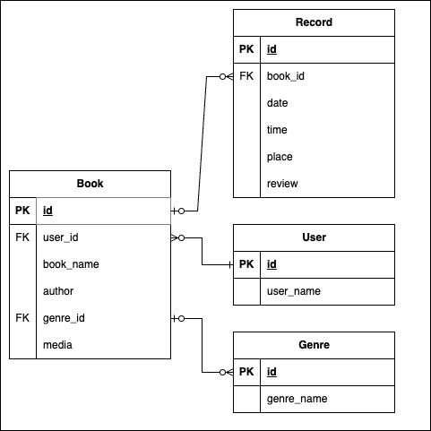

# nri4-api-solo-pj

読書を記録するアプリです。

## 提供機能

### API

---

#### [GET] /users/:user_id/books/:book_id/

任意の書籍の読書記録取得API

##### 処理内容

- 任意の書籍に関する読書記録を返す。
- ユーザID及び書籍IDがいずれも指定されている場合、ユーザID及び書籍IDに紐づく読書記録の一覧を返す。
- 読書記録がない場合は空の配列を返す。
- ユーザID及び書籍IDはいずれも必須。どちらも指定がない、もしくは不正な型の場合には、Bad Requestを返す。

##### Example URI

GET /users/1/books/1/

- URI Parameters
  - user_id - ユーザID(整数型、必須)　Example: 1
  - book_id - 書籍ID(整数型、必須)　Example: 1

##### Response 200

###### Headers

```
Content-Type: application/json
```

###### Body

```
{
    "records":[
        {
            id: 1,
            book_id: 1,
            date: "2023/11/01",
            time: 100,
            place: "home",
            review: 3.0
        },
        {
            id: 2,
            book_id: 1,
            date: "2023/11/07",
            time: 150,
            place: "home",
            review: 4.0
        }
    ]
}
```

##### Response 200 - Result Empty -

###### Headers

```
Content-Type: application/json
```

###### Body

```
{
    "records":[]
}
```

##### Response 400

###### Headers

```
Content-Type: application/json
```

###### Body

```
{ msg: "Bad Request" }
```

---

#### [POST] /users/:user_id/books/:book_id/

任意の書籍の読書記録追加API

##### 処理内容

- 任意の書籍に関する読書記録を追加する。
- ユーザID及び書籍IDがいずれも指定されている場合、ユーザID及び書籍IDに紐づく新たな読書記録を追加して、HTTPステータス200を返す。
- 指定されたユーザID及び書籍IDに紐づく書籍が存在しない場合、Not Foundを返す。
- ユーザID及び書籍IDはいずれも必須。どちらも指定がない、もしくは不正な型の場合には、Bad Requestを返す。

##### Example URI

POST /users/1/books/1/

##### URI Parameters

- user_id: 1 (整数型、必須) - ユーザID
- book_id: 1 (整数型、必須) - 書籍ID

###### Request Body

```
{
    date: "2023/11/01",
    time: 100,
    place: "home",
    review: 3.0
}
```

##### Response 400

###### Headers

```
Content-Type: application/json
```

###### Body

```
{ msg: "Bad Request" }
```

##### Response 404

###### Headers

```
Content-Type: application/json
```

###### Body

```
{ msg: "Not Found" }
```

---

#### [PATCH] /users/:user_id/books/:book_id/records/:record_id

読書記録修正API

##### 処理内容

- 任意の書籍に関する読書記録を更新する。
- ユーザID及び書籍ID、記録IDがいずれも指定されている場合、ユーザID及び書籍ID、記録IDに紐づく読書記録を修正してステータスコード200を返す。
- リクエストボディに記載された項目のみ更新する。
- 対象の読書記録がない場合は、Not Foundを返す。
- ユーザID及び書籍ID、記録IDはいずれも必須。いずれかが指定がない場合には、Bad Requestを返す。

##### Example URI

PATCH /users/1/books/1/records/1/

##### URI Parameters

- user_id: 1 (整数型、必須) - ユーザID
- book_id: 1 (整数型、必須) - 書籍ID
- record_id: 1 (整数型、必須) - 記録ID

###### Request Body

```
{
    date: "2023/11/01",
    time: 100,
    place: "home",
    review: 3.0
}
```

##### Response 200

###### Headers

```
Content-Type: application/json
```

##### Response 400

###### Headers

```
Content-Type: application/json
```

###### Body

```
{ msg: "Bad Request" }
```

##### Response 404

###### Headers

```
Content-Type: application/json
```

###### Body

```
{ msg: "Not Found" }
```

---

#### [DELETE] /users/:user_id/books/:book_id/records/:record_id/

読書記録削除API

##### 処理概要

- 任意の書籍に関する読書記録を削除する。
- ユーザID及び書籍IDがいずれも指定されている場合、ユーザID及び書籍IDに紐づく読書記録を削除する。
- 対象の読書記録がない場合は、Not Foundを返す。
- ユーザID及び書籍ID、記録IDはいずれも必須。いずれかが指定がない場合には、Bad Requestを返す。

##### Example URI

DELETE /users/1/books/1/records/1/

##### URI Parameters

- user_id: 1 (整数型、必須) - ユーザID
- book_id: 1 (整数型、必須) - 書籍ID
- record_id: 1 (整数型、必須) - 記録ID

##### Response 200

###### Headers

```
Content-Type: application/json
```

###### Body

```
{ msg: ”Success" }
```

##### Response 400

###### Headers

```
Content-Type: application/json
```

###### Body

```
{ msg: "Bad Request" }
```

##### Response 404

###### Headers

```
Content-Type: application/json
```

###### Body

```
{ msg: "Not Found" }
```

---

## Appendix

### ER図


